# Introduction to R {#intro}

For this course we will be using [R](https://www.r-project.org/) [@R-base] and [R Studio](https://rstudio.com/) as the main tools for conducting quantitative analysis. `R` and the basic versions of `R Studio` are open-source and thus free software. Even though `R` appeared in the early 90s, it has been gaining a lot of popularity in recent years. In fact, it is now one of the most common software for doing statistics in academia.

```{r fig.cap="Soruce: www.https://tiobe.com/.", include=FALSE}
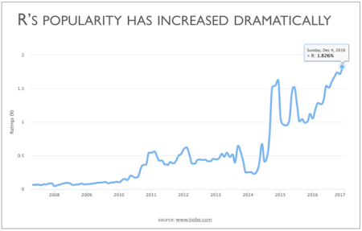
```
<br>

`R` and `R Studio` are two separated things. R is the actual programming language and the main processing tool which does the computations in the background, whereas RStudio integrates all functionalities in a friendly and interactive interface. In short, for this course (and most of the times in practice) you only work in RStudio. Thereafter, we will refer to R, as the integrated interface.

`R` works as a command-based line user interface most of the time. This means that you need to call the commands (or _**functions**_, as they are called in R) through text lines. This can look intimidating at first glance. But do not worry, we will guide you step by step.

At this point you may be wondering why you need to bother learning these tools. In the next section you will see some of the advantages and examples that can be achieved using `R`.

## Why R?

### R: a flexible tool

R can be applied in a wide variety of fields and subjects, including not only those in the social sciences (e.g. sociology, politics or policy research), but also in humanities (e.g. history, digital humanities), natural and physical sciences (e.g. biology, chemistry or geography), health (e.g. medical studies, public health, epidemiology), business and management (e.g. finance, economics, marketing), among many others. 

The broad application of R is due to its flexibility which allows to perform a range of tasks related to data. These cover tasks at initial stages, such as downloading, mining, or importing data. But it is also useful to manipulate, edit, transform, and organize information. Furthermore and most important for us, there are set of tools that allows us to analyse data using a range of statistical techniques. These are useful to understand, summarize and draw conclusions about samples, e.g. people. Lastly, `R` is powerful to communicate and share information and documents. There are several extensions (called _**packages**_ in R) that can help to produce static and interactive plots/charts, maps, written reports, interactive applications or even entire books! In fact this workbook was written from RStudio.

### Advantages of using R

Some of the advantages of using R are the following:

* It is free and open source. You do not need to pay for a license. Thus you can use it at any-where any-time even if you do not have an affiliation to an institution or organization (e.g. University or workplace);
* It is a collaborative project. This means that it is the users who maintain, extend and update its applications;
* It is reproducible. Research can be more transparent since you will get the same results every time you run your analysis through an specific pathway (i.e. through scripts);
* High compatibility. You can read and produce most types of file extensions;
* There are a number of easy-access web resources to support you in the learning process.

<!-- ### Activity. Examples -->

<!-- So far we have talked about some properties of R, but it is worthwhile having a look your-self and discover some of the potential through some examples using _real-life_ data sets. Please take a few minutes to explore the following links that were completely developed using R. -->

<!-- * [COVID-19 tracker](https://vac-lshtm.shinyapps.io/ncov_tracker/?_ga=2.140661819.883107759.1598267087-903949304.1571305449) -->
<!-- * [69 Love Songs: A Lyrical Analysis](https://committedtotape.shinyapps.io/sixtyninelovesongs/) -->
<!-- * [ScotPHO's profiles tool](https://scotland.shinyapps.io/ScotPHO_profiles_tool/) -->

<!-- What do you think about them? Which one did you enjoy the most? -->

<!-- Of course the examples above are meant for you to have a sense of the flexibility and potential to process and communicate quantitative analyses in `R`. This course covers the basics to process data and conduct quantitative analyses in social sciences. -->

## Get started
### Setting RStudio

At this point you need to know that there are at least two alternatives to start using RStudio. One, and by far the most common, is to download both `R` and RStudio and install the applications in your local drive. The other option is RStudio Cloud. This is an on-line version of RStudio that does not require installing any additional software. You can run it directly from your browser (e.g. GoogleChrome, Safary, Firefox, etc). For now, we will use the cloud version. 

To get started, follow the next steps:

**Part 1** Create an RStudio Cloud account.

1. Click on this link [RStudio Cloud](https://rstudio.cloud/), which should automatically open a new tab in your web browser or go directly to the browser and copy this URL: https://rstudio.cloud/;
2. Click on the "Get started for free" option. Click on the "Sign up" button (ignore the 'Plus' option);
3. Enter your details and sign up with your student *UoG email address* (if available, access using the institutional log in option using your UoG credentials);
4. Access your UoG email and verify your address by following the instructions you received in an email.

<br>

**Part 2** Join your lab group.

1. You will receive a link from your tutor to join your lab group. Copy and paste it in your web browser. You should see the following window:
```{r fig.cap="Join Space.", echo=FALSE}
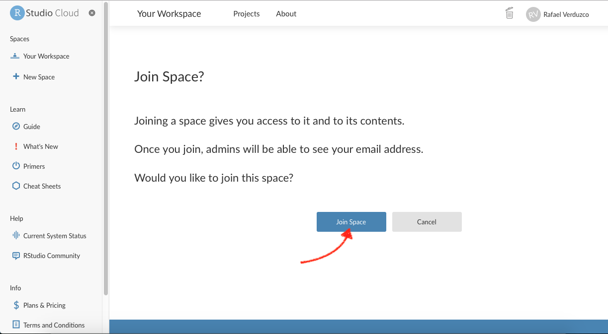
```
2. Join your lab by clicking on the 'Join space' button shown above.
3. Open the shared space form the left-hand side pane called 'Quants Lab Group..' and start the Lab 1 project by clicking on the 'Start' button as shown below:
```{r fig.cap="Start project.", echo=FALSE}
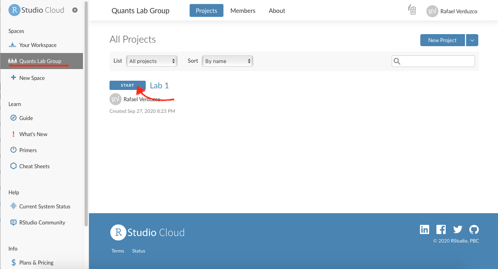
```

<!-- <br> -->
<!-- In addition and only optionally you can download and install the Desktop versions by following these links: -->

<!-- * R https://cran.r-project.org/mirrors.html (You can choose any of the host institutions). -->
<!-- * RStudio https://rstudio.com/products/rstudio/ (Choose the RStudio Desktop free version). -->

<!-- For detailed instructions on how to set up R and RStudio Desktop version, watch [Video 2, Chapter 2](https://study.sagepub.com/fogarty/student-resources/r-screencast-tutorials/chapter-2-introduction-to-r-and-r-studio) [@Fogarty2019]. Remember this is only optional for now. -->


### RStudio environment
#### RStudio screen

Once you have started 'Lab 1' you will see the screen below.

<br>
```{r fig.cap="Project name.", echo=FALSE}
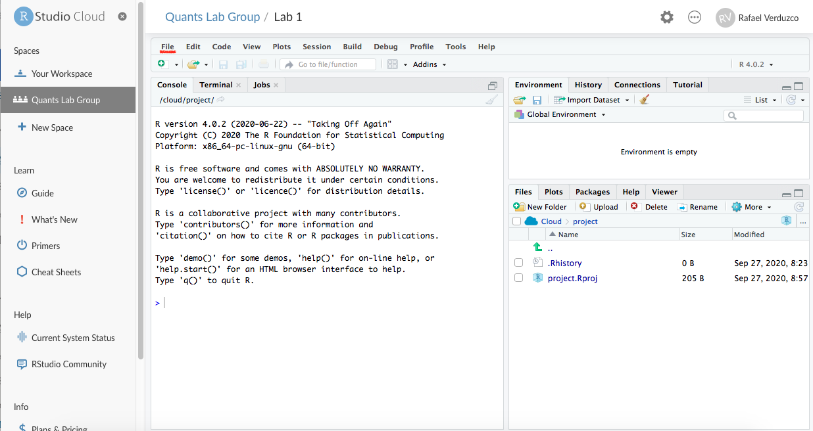
```
<br>

Now, go to the "File" tab and create a R Script as follows `File > New file > R Script`

<br>
```{r fig.cap="New R Script.", echo=FALSE}
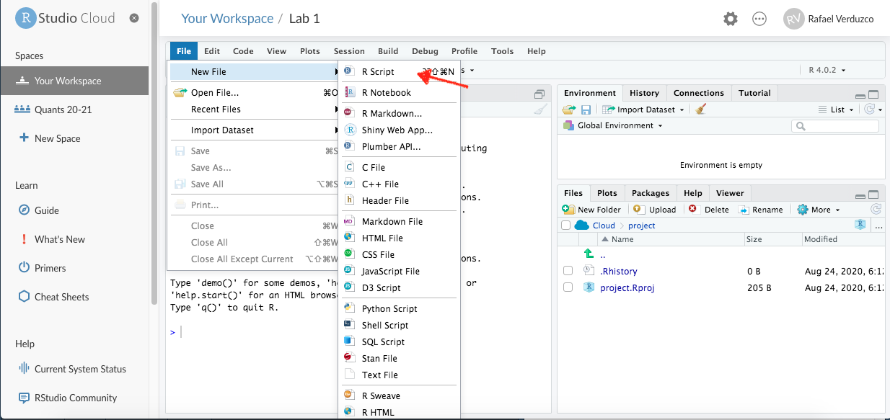
```
<br>

Once you have created your first R Script, save it by clicking on File > Save as.. > `[write the name of your file]`. 

After this, your RStudio screen will be split in four **imporant** windows or panes as shown below:

<br>
```{r fig.cap="R Studio panes.", echo=FALSE}
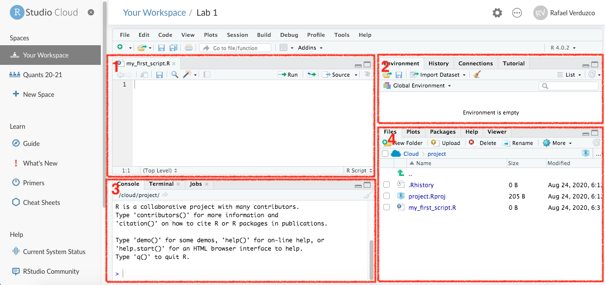
```

* In **Pane 1**, you have your newly created `R` script. This is the area where you will be working most of the time. From here, you will write functions. To run a an `R` script line, you can click on the `Run` green arrow situated on the top of pane 1 or more commonly you can run a code line by typing `alt + enter`. The things you write in this section will be saved in your R script file.
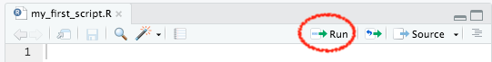
* In **Pane 2**, you have the "Global Environment", this is one of the most useful tabs in this pane. It shows you the active 'objects' that you have available/loaded in your current session (this will probably make more sense in the coming sections).
* In **Pane 3**, you have the R Console, this is where you will see most of the results of the functions you run from your script (pane 1). You can also write and run functions from here, by typing the function and hitting enter. NOTE that what you do here will NOT be saved, this is usually used to quickly call functions that you do not want to save in your script.
```{r fig.cap="Console.", echo=FALSE}
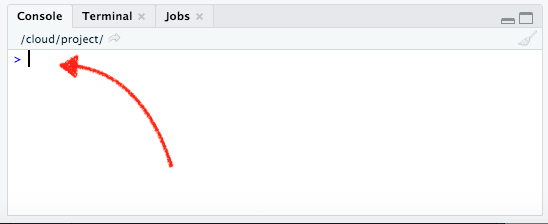
```
* Finally, in **Pane 4** you have multiple useful tabs. In the `File` tab you can see the files and directories that you have in your R project. In the `Plot` tab you will see a preview of the static plots/charts your will be producing form your scrip. In `Packages`, you have a list of the extensions or plug-ins (called 'packages' in R) that are installed in your working environment. The `Help` contains some resources that clarify or expand what each of the functions does. Again, probably this will make more sense once you get started. We will come back to this later. Finally, the `Viewer` displays interactive outputs.

## Hands on R

Now you are ready! It is your turn to start exploring and getting familiar with R by completing the following activities.

#### R as calculator

Go to your console (pane 3), write some simple calculations and run them by typing 'enter' after each of them, as shown below.

```{r fig.cap="R Console as calculator.", echo=FALSE}
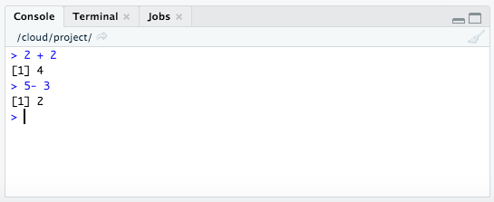
```

<br>
Try different operations such as `50 / 20` or `3 * 5`.

Fairly simple, right? Let's continue with the next activities.

#### Testing logical operators

Now, write and run the following lines in your console and take some time to observe the result in detail for each of them:

* `10 == 10`
* `10 != 10`
* `1 == 5`
* `1 > 5`
* `'a' == 'a'`
* `'a' == 'b'`

What do you see? ... 

...That's it! When you use the double equal sing `==` you are _asking_ R whether the value on the left hand-side of the operator is equal to the one on the right hand-side. Likewise, when you combine the exclamation sign `!` with other operator, you get the reversed result. In the past exercises you used `!=`, this was interpreted as "is not equal to", that is why `10 != 10` returns `FALSE`, but `10 == 10` returns `TRUE`. 

`R` can process different classes of inputs. In this case we used letters and we _asked_ R whether 'a' was equal to 'a', and of course the result is `TRUE`. Note that when you want to input text (referred as _character_ values in R), you need quotation marks `'`. If you want to enter numeric values, you simply input the raw number. These are different 'class' values.

Perhaps logical operators do not make much sense at this point, but you will find out later that they are useful to manipulate data. For example, these are essential to filter a data set based on specific _rules_ or patterns.

#### Assigning values to 'objects'

In `R`, it is very common (and practical) to store values or data as 'objects'. These are temporally stored in your current session. Let's try it! In your `R` script (Pane 1), write the following and run it by clicking the green arrow or using `alt + ent`:

```{r eval = FALSE}
a <- 10
a + 5
```

What do you observe?...

...That's right! The operator `<-` assigned the numeric value `10` to the object `a` (on the left hand-side of the arrow). Later, you used the object (`a`) to compute a sum (i.e, `a + 5`). 

Now, write and run the following in your `R` script:

```{r eval = FALSE}
c <- 3
a  *  c
```

As you can see, you stored the numeric value `3` in the variable `c`. Then, you called the previously created object `a` in a multiplication. 

In the same way as you assigned this simple variables, you will store other type of objects later, e.g. vectors, data frames or lists. This is useful because those objects will be ready in your session to do some computations.

There are few things to note when assigning objects to variables. If you use a different value to the same variable, e.g. by typing `a <- 5`, you will replace the old value with the new. So, instead of having `a` representing the value 10, you will have `5`. You can see the objects available in your session on the Global Environment ('Environment' tab in Pane 2) as shown below.

<br>
```{r fig.cap="'Environment' tab.", echo=FALSE}
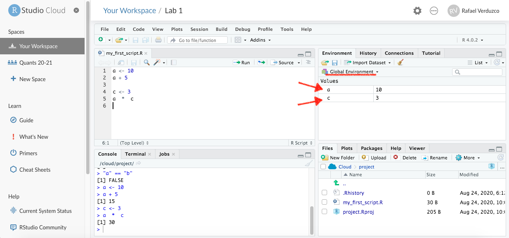
```

<!-- ### Load your first file -->

<!-- You are now done with the basics, it is time to get serious. We will use R to download a real data set and then we will load it as an object in our working session. The data we will use for this exercise is the [Scottish Hill Races](https://dasl.datadescription.com/datafile/scottish-hill-races/). -->

<!-- The first thing you will do is download the data set. Copy, paste the following bit in to your R Script (pane 1) and run it: -->

<!-- ```{r eval = FALSE} -->
<!-- download.file('https://dasl.datadescription.com/download/data/3440', 'scottish-hill-races.txt') -->
<!-- ``` -->

<!-- As you can see, the previous function `download.file()` takes two specifications (called arguments in R) separated by a comma `,`. The first is the URL, and the second is the destination of the file, in this case it specifies the name and extension of the file. Both of these arguments need to be enclosed in quotation marks. Note in the File tab of pane 4 that you have a new document in your Project. -->

<!-- <br> -->
<!-- 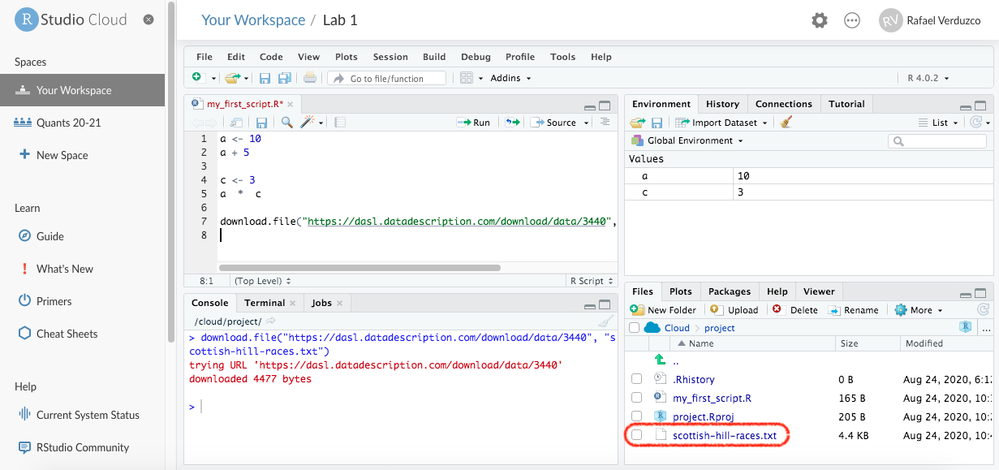 -->

<!-- <br> -->
<!-- Next, we will read the data using the function `read.delim()` and we will assign it as `scottish_races`. Copy the following line, paste it and run it. -->

<!-- ```{r eval = FALSE} -->
<!-- scottish_races <- read.delim("scottish-hill-races.txt", sep = "\t") -->
<!-- ``` -->

<!-- If you look at your Global Environment tab in pane 2, you will see that you have a new object called 'scottish_races'. It also gives you some basic information, e.g. it says that data has 94 observations and 5 variables (94 rows and 5 columns). -->

<!-- Now you can explore your new data set which is available in your session. Use following functions in your script to understand the data: -->

<!-- ```{r eval = FALSE} -->
<!-- names(scottish_races) -->
<!-- str(scottish_races) -->
<!-- summary(scottish_races) -->
<!-- ``` -->

<!-- What can you see? -->

<!-- Finally, a handy function that lets you visualize the data is `View()`. Write it in your console and run it: -->

<!-- `View(scottish_races)` -->

<!-- By running this function, the following tab will automatically pop-up in pane 1: -->

<!-- <br> -->
<!-- 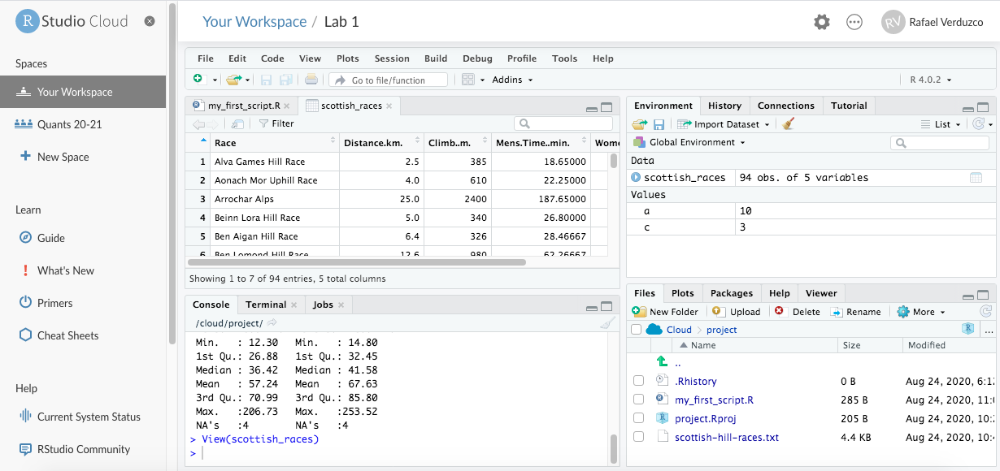 -->
<!-- <br> -->

<!-- Here, you can scroll down or visualize your columns to your right in a table-style format. You can sort the contents of the variables by clicking on the header. But note that you cannot make any changes from here. Once you finished checking your data, simply click on the cross mark and you will be back to your script tab. -->

This is a very good start, great job! 

Note that the changes made in your script are saved automatically in RStudio Cloud. To verify this, have a look at the name of your script in the top-left of pane 1. If changes are due to be saved, the name will be written in red. If it is in red, save changes manually by clicking on the disk icon. After you have made sure your changes are saved, end your session simply by closing the RStudio Cloud tab in your browser.


