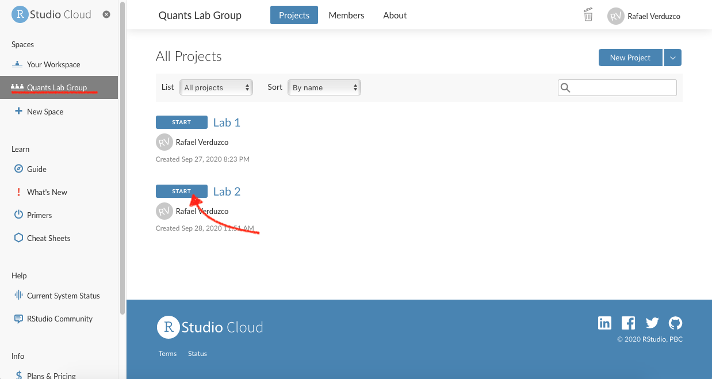
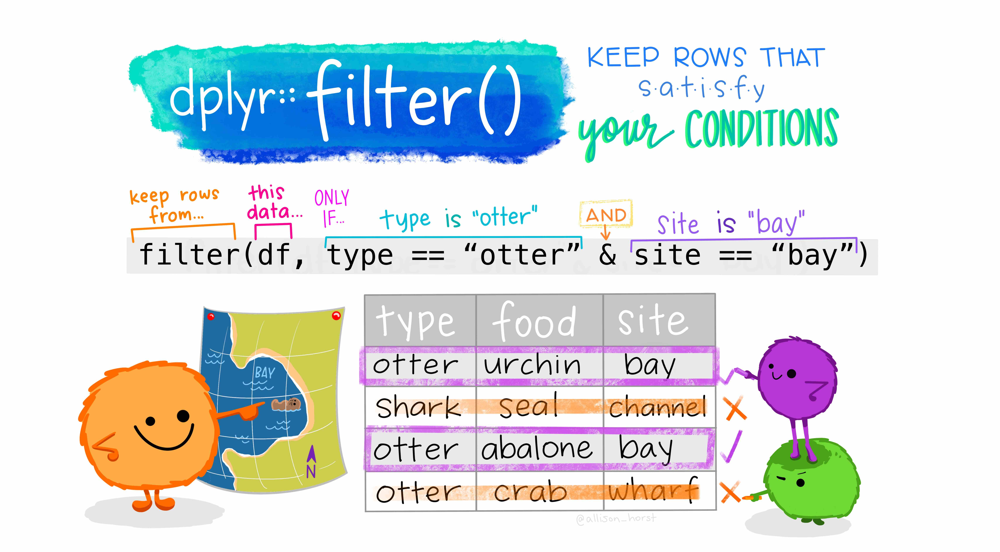

# Data in R{#lab2}

## Welcome back!

In our previous lab, we set up an RStudio Cloud session and we got familiar with the RStudio environment and some of the purpose and contents of its panes. In this Lab we will learn about R packages, how to install them and load them. Also, we will use different types of data. You will have the chance to practice with additional `R` operators. Lastly, we will load a real-world data set and put in practice your new skills.

## R Packages{#learn-packages}

As mentioned in our last lab, `R` [@R-base] is a collaborative project. This means that `R` users are developing, maintaining, and extending the functionalities constantly. When you set up `R` and RStudio for the first time, as we did it last week, it comes  only with the 'basic' functionalities by default. However, there are literally thousands of extensions that are developed by other users. In R, these non-default extensions are called _**packages**_.

Most of the times, we use packages because they simplify our work in `R` or they allow us to extend the capabilites of base R.

### Installing packages{#installing-packages}

Let's put hands-on to install and load some useful packages. We will start with `tidyverse` [@R-tidyverse].^[<https://www.tidyverse.org/>]

### Activity: 

**Part 1**. Access your lab group in R Studio Cloud

1. Make sure you have a free, institutional-subscription [RStudio Cloud](https://rstudio.cloud/) account (in case you have not created one yet, please follow the guidance provided in [Lab 1](#lab-intro));
2. You will receive a link from your tutor to join your lab group in a shared space. Copy and paste it in your web browser (log in if necessary). If you already joined your lab group in RStudio Cloud, simply access the 'Lab 2' project and omit steps 3 to 5. Otherwise, continue with steps 3, 4 and 5.
3. If you did not join your lab group yet, you should see the following window:
```{r fig.cap="Join Space", echo=FALSE}
knitr::include_graphics("./images/rstudio_cloud_joinspace.png")
```
4. Click on the 'Join space' button shown above.
5. Open the shared space form the left-hand side pane called 'Quants Lab Group..' and start the Lab 2 project by clicking on the 'Start' button as shown below:
```{r fig.cap="Start Lab 2.", echo=FALSE}

```

<br>
**Part 2**. Working on your script

1. Once you have accessed the 'Lab 2' project, write or copy the following line in your **script** (pane 1) and run it:
```{r eval = FALSE}
install.packages('tidyverse')
```
2. Wait until you get the message 'The downloaded source packages are in...'. The installing process can take up to a couple of minutes to finish.
3. Once the package is installed, you need to load it using the `library()` function. Please, copy and paste the following line, and run it:
```{r eval = TRUE}
library(tidyverse)
```

And that's it, `tidyverse` is ready to be used in your current session!

There are couple of things you should know. First, the packages need to be installed only per project in RStudio Cloud (and only once if you are working in RStudio Desktop version). However, packages must be loaded using the `library()` function every time you restart an R session. 

Another thing to notice is that when you install a package you need to use quotation marks, whereas in `library()` you only need to write the plain package name within brackets. Usually, you will load the packages at the beginning of your script.


## Types of variables

`R` can handle many classes of data. It is crucial that you can distinguish the main ones. Broadly speaking there are two types of variables,

1. **categorical** and; 
2. **numeric** (formally know as interval or ratio). 

Categorical variables are distinctive because they are limited in the number of categories it can take, e.g., country, name, political party, or gender. Ordinal data is a *sub-type* of the categorical, and it is used when the categories can be ranked and their order is meaningful, e.g., education level or level of satisfaction. Numeric values can be continuous (these are usually measured and can take infinite values, e.g. speed or time).^[For more details, please refer to the DataCamp module [Introduction to Data in R](https://learn.datacamp.com/courses/introduction-to-data-in-r).]

In `R`, the basic types of data are known as 'atomic vectors' and there are 6 of them (logical, integer, double, character, complex and raw). In the social sciences, we often use the following: `numeric`, `factor` and `character`. Numeric vectors are used to represent continuous numerical data.^[Notice that `numeric` vectors can be represented as `integer`or `double` in `R`, their difference is of little relevance for now.] On the other hand, factor vectors are used to represent categorical and ordinal data.

In R, there are couple of functions that will help us to identify the type of data. First, we have `glimpse()`. This prints some of the main characteristics of a data set, namely its overall dimension, name of each variable (column), the first values for each variable, and the type of the variable. Second we have the function `class()`, that will help us to determine the overall class(type) of on `R` object.

### Activity:

We are now going to use some datasets that are pre-loaded in the `R` session by default. Please go to your 'Lab_2' project in RStudio Cloud and do the following:

1. We will start with a classic dataset example in R called `iris`. This contains measurements of various flowers species (for more info type `?iris` in your console). Please go to your **console** and type the line below.
```{r eval=FALSE}
glimpse(iris)
```
2. What do you observe from the output?... First, it tells you the number of rows and the columns on the top. Later, it lists the name of each variable. Additionally, it tells you the type of the variable between these symbols `< >`. The first five variables in this dataset are of type `<dbl>` which is a type of numeric variable. The last, `Species`, is a factor `<fct>`. In sum, there is information of the species and four types of continuous measures associated to each flower in this dataset.
3. Now you know that each flower belongs to a species, but what are the specific categories in this data set? To find out, type the following in your console.
```{r eval = FALSE}
levels(iris$Species)
```
4. As you can see, there are three categories, which are three types of flower species. In `R` the categories in factor vectors are are called _levels_.

Note the syntax above. Inside the function, we used the name of the dataset followed by the dollar sign (\$) which is  is needed to access the specific column/variable `Species`.

<!-- Let's move to a different data set. This time we will use another classic example called `diamonds`. This data set contains some characteristics of more than 50K pieces of diamonds (to get more information type `?diamonds` in your console). -->

<!-- 1. Let's glimpse at the `diamonds` data by running this line in your console. -->
<!-- ```{r eval=FALSE} -->
<!-- glimpse(diamonds) -->
<!-- ``` -->
<!-- 2. What can you observe?...Yes, this time we do not have factor columns, but we have `<ord>` in cut, colour and clarity, which means these are ordinal vectors. Now look at the levels of cut: -->
<!-- ```{r eval=FALSE} -->
<!-- levels(diamonds$cut) -->
<!-- ``` -->
<!-- 3. As you can see, there are five types of cut in this data set. You can even go further and find out how many diamond pieces are of each type by running this line: -->
<!-- ```{r eval=FALSE} -->
<!-- table(diamonds$cut) -->
<!-- ``` -->

Now, let's get serious and explore Star Wars. Yes, the famous film series! 

The `starwars` data set from the `dplyr` package contains information about the characters, including height, hair colour, and sex (to get more information type `?starwars` in your console). At this time we will use a reduced version of the full data set. Please complete the following activities from your `R` script (pane 1).

1. First, we will run the next couple of lines to reduce the data set, and then we will glimpse the Star Wars characters:
```{r eval=FALSE}
starwars2 <- starwars[ ,1:11]
glimpse(starwars2)
```
2. What do you observe this time? ... It seems that the data type is not consistent with their content. For example, the variables `species`, `gender`, and `hair_color` are of type `<chr>` (that is `character`), when according to what we just learnt they should be a factor. To transform them, we will use the function ´factor()´. This process is known as coercing a variable, that is when you change from one type to another.
<!-- 3. Look what happens if you do the this..It confirms that this variable is stored as a character: -->
<!-- ```{r eval=FALSE} -->
<!-- class(starwars2$species) -->
<!-- ``` -->
<!-- 5. What if we first call the `factor()` function and then we ask R again about the type of vector using `class()` -->
<!-- ```{r eval=FALSE} -->
<!-- factor(starwars2$species) %>% class() -->
<!-- ``` -->
6. Let's coerce the species variable from character to factor and assign the result to the same column in the dataset.
```{r eval=FALSE}
starwars2$species <- factor(starwars2$species)
```
7. Let's check if the type of variable really changed by glimpsing the data and checking the levels of `species`. 
```{r eval=FALSE}
glimpse(starwars2)
levels(starwars2$species)
```

The glimpse result now is telling us that `species` is a `<fct>`, as expected. Furthermore, the `levels()` function reveals that there are 37 types of species, including Human, Ewok, Droid, and more.

Hopefully, these examples will help you to identify the the main vector types and more importantly to coerce them in an appropriate type. Be aware that many data sets represent categories with numeric values, for example, using '0' for males and '1' for females. Usually, large data sets are accompanied by extra information in a _code book_ or _documentation_ file, which specifies the values of the numeric code and their respective meaning. It's important to read the code book/documentation of every dataset as the conventions and meanings can vary.

## More operators and some essential symbols

<!-- More operators and symbols...Let's start with the hashtag `#`. Even though this is not an operator in R, this symbol allow us to include a comment or ´mute´ the whole line in your script. In fact, it is important that you add comments on your own code, so when you come back later to your code, you can have a quicker idea of what it is going in each line of the script. -->

<!-- The dollar sign `$` is frequently used and it is part of base R. Actually, we used it a couple of times in the previous section. This is used to access or extract information from an object (e.g. a data set). For instance, earlier we selected only one variable from the `starwars` data set by writing `starwars2$species`. A practical tip to quickly access or find variables in a data set is to write the name of your object followed by the dollar sign only, like this: `starwars2$` (without specifying the variable to be accessed yet). After, type `tab` in your keyboard. Then, R will display a list with the variables available. Try it yourself! -->

A useful operator is the pipe `%>%`. This is part of the `tidyverse` package. So, it is ready for you to use. This operator passes the result of one operation to the next. Check the results of the following operations in your **console**:

```{r eval = FALSE}
1 %>% + 1
1 %>% + 1 %>% + 5
```

Observe what happened...The result from the first line was 2. This is because this line can be read as: 'take 1, THEN sum 1'. Therefore, the result is 2. 

Similarly, the second line follows this process: 'take 1, THEN sum 1, take the result of this (which is '2') and THEN sum 5'. Therefore, the result is 7. This can sound a bit abstract at this point, but we will practice with some data in the next section.

## Black lives matter!

In this section we will work with data originally collected by The Guardian in 2015, for more information click [here](https://www.theguardian.com/us-news/ng-interactive/2015/jun/01/about-the-counted). The data set we will use today is an extended version which was openly shared in GitHub by the American news website [FiveThirtyEight](https://fivethirtyeight.com/). This data set contains information about the people that were killed by police or other law enforcement bodies in the US, such as age, gender, race/ethnicity, etc. Additionally, it includes information about the city or region where the event happened. For more information click [here](https://github.com/fivethirtyeight/data/tree/master/police-killings).

### Downloading and reading the data

For the following excercices, please make sure that your are working in your `R` script.

First, we will create a new folder in our project directory to store the data. To do it from `R`, run this line in your script (Don't worry if you get a warning. This appears because you already have a folder with this name):
```{r}
dir.create("data")
```

Note that in the 'Files' tab of Pane 4, there is a new folder called `data`.

Now, download the data from the GitHub repository using the function `download.file()`. This function takes two arguments separated by a comma: (1) the URL and (2) the destination (including the directory, file name, and file extension), as shown below. Also, since the file we downloaded is wrapped in a `.zip` file, we will need to unzip it using `unzip()`. Copy, paste in your script, the following lines: 
```{r eval = FALSE}
download.file("https://projects.fivethirtyeight.com/data-webpage-data/datasets/police-killings.zip",
              "data/police-killings.zip")
unzip("data/police-killings.zip", exdir = "data")
```

After following the previous steps, we are ready to read the data. As you can see in the 'File' tab, the data comes as a `.csv` file. Thus, we can use the `read_csv()` function included in the `tidyverse` package (make sure you the package is loaded in your session as explained in a [previous section](#installing-packages)). We will assign the data in an object called `police`.
```{r eval = FALSE}
police <- read_csv("data/police-killings/police_killings.csv")
```

### Examining the data

If you look at your 'Environment' tab in pane 2, you will see there is a new object called `police`, which has 467 observations and 34 variables (or columns). To start exploring the contents, we will glimpse the `police` data as following:
```{r eval = FALSE}
glimpse(police)
```

As you can see, there are several variables included in the dataset, such as age, gender, law enforcement agency (`lawenforcementagency`), or whether the victim was armed (`armed`). You will see some of these variables are not in the appropriate type. For instance, some are categorical and should be type `<fct>` instead of `<chr>`. 

### Data wrangling

Before coercing these variables, we will create a smaller subset selecting only the variables that we are interested in. To do so, we can use the `select()` function. The `select` function takes the name of the data first and then the name of the variables we want to keep (no quotation marks needed). We will select a few variables and assign the result to a new object called `police_2`.
```{r eval = FALSE}
police_2 <- select(police, age, gender, raceethnicity, lawenforcementagency, armed)
```

If you look again to the 'Environment' tab, there is a second data set with the same number of observations but only 5 variables. You can glimpse this object to have a better idea of its contents.
```{r eval = FALSE}
glimpse(police_2)
```

Having a closer look at the reduced version, we can see that in fact all the variables are of type `<chr>`, including `age`.

Let's coerce the variables in to their correct type. We will start with age, from character to numeric:
```{r eval = FALSE}
police_2 <- police_2 %>% mutate(age = as.numeric(age))
```

Age is not known for some cases. Thus, it is recorded as 'Unknown' in the dataset. Since this is not recognized as a numeric value in the coercion process, `R` automatically sets it as a missing value, `NA`. This is why it will give you a warning message.

We can continue coercing `raceethnicity` and `gender` from character to a factor:
```{r eval = FALSE}
police_2 <- police_2 %>% mutate(raceethnicity = factor(raceethnicity))
police_2 <- police_2 %>% mutate(gender = factor(gender))
```

Let's run a summary of your data. This shows the number of observations in each category or a summary of a numeric variable:
```{r eval = FALSE}
summary(police_2)
```

There are some interesting figures coming out from the summary. For instance, in age you can see that the youngest is... 16 years old(?!), and the oldest 87 years old. Also, the vast majority are male individuals (445 vs 22). In relation to race/ethnicity, roughly half of them is 'White', whereas 'Black' individuals represent an important share. One may question about the proportion of people killed in terms of race/ethnicity compared to the composition of the total population (considering Black is a minority group in the US).

Let's suppose that we only want observations in which race/ethnicity is not unknown. To 'remove' _undesired_ observation we can use the `filter()` function. We will assign the result of `filter` in a variable called `police_2`.
```{r eval = FALSE}
police_2 <- police_2 %>% filter(raceethnicity != 'Unknown')
```

So, what just happened in the code above? First, the pipe operator, `%>%`: What we are doing verbally is _take the object `police_2`, THEN filter raceethnicity based on a condition_. Later, what is happening inside `filter`? Lets have a look at what `R` does in the background for us (Artwork by \@alison_horst):

```{r fig.cap="Filter. Source: Artwork by @Horst.", echo=FALSE}

```


In the example above, we are keeping the observations in `raceethnicity` that are NOT EQUAL to 'Unknown'. Finally, when we assigned the result to an object named as the same as our previous object, we replaced the _old_ dataset with the filtered version.

<!-- Finally, there are times when you would like to group categories in a factor differently, for example to simplify a graph or statistical analysis. Coming back to race/ethnicity, we may observe that there are some relatively small categories, e.g. 'Native American', 'Asian/Pacific Islander'. So we will create a new variable called `raceethnicity_recoded` using `mutate()` which will recode these categories in to one only called 'Other' using the function `recode()`. We will save the result under the same data named `police_2`. -->

<!-- ```{r eval = FALSE} -->
<!-- police_2 <- police_2 %>%  -->
<!--   mutate(raceethnicity_recoded = recode(raceethnicity, -->
<!--                                         'Asian/Pacific Islander' = 'Other',  -->
<!--                                         'Native American' = 'Other')) -->
<!-- ``` -->

<!-- If we look at the summary again, the classifications of `raceethnicity` are reduced in the new variable `raceethnicity_recoded`. The categories 'Native American' and 'Asian/Pacific Islander' were summed in only one category called `Other`. -->

## Activity

Discuss the following questions with your neighbour or tutor:

1. What is the main purpose of the functions `select()` and `filter`?
2. What does *coerce* mean in the context of `R`? and Why do we need to coerce some variables?
3. What is the `mutate()` function useful for?

Using the police_2 dataset:

1. Filter how many observations are ‘White’ in `raceethnicity`? How may rows/observations are left?
2. How many ‘Latino/Hispanic’ are there in the dataset?
3. Using the example of Figure 2.3, could you filter how many were killed that were (a) 'Black' and (b) killed by firearm ('firearm')?
4. What about 'White' and 'firearm'?

<!-- Extra activities: -->
<!-- 1. Why did you have to use quotes in the following: `filter(police, raceethnicity==”White” & raceethnicity==”firearm”)`? -->
<!-- 2. What do you have to repeat the variable `raceethnicity` twice? -->


This is the end of Lab 2. Again, the changes in your script should be saved automatically in R Studio Cloud. However, make sure this is the case as you were taught in Lab 1. After this, you can close the tab in your web browser. Hope you had fun!

<br>


