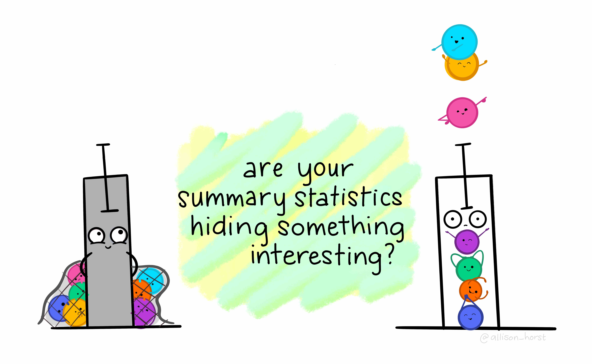

# Exploratory data analysis

In our previous session we learned about wrangling data in `R` by implementing useful function such as `filter()`, `select()`, and `mutate()`. In this session we will focus on descriptive statistics. This includes the exploration and description of quantitative data.

## Getting started

We will continue working on the same project and dataset that you created in the last lab on R Studio Cloud. Please follow the next steps:

1. Go to your 'Quants lab group' in [RStudio Cloud](https://rstudio.cloud/).
2. Open the project called 'NILT' located in your lab group'.
3. Continue working at the bottom of the 'Exploratory analysis' script that you created in the last lab.
4. Load `nilt` dataset that you create in the last session using the following code:
```{r}
# Load the data from the .rds file we created in the last lab
nilt <- readRDS("data/nilt_r_object.rds")
```
5. Create a subset of the `nilt` data keeping only few variables using the `select()` function as shown below:
```{r}
#Subset
nilt_subset <- select(nilt, rsex, rage, highqual, religcat, uninatid,  ruhappy, rhourswk, persinc2)
```

## Exploratory analysis
### Data overview

Are your summary statistics hiding something interesting?
```{r fig.cap="Exploratory analysis.", echo=FALSE}

```

<!-- There are some basic functions that will allow you to understand and get familiar with the data. You used an important one already, `glimpse()`. But there are other useful ones. For instance, try `names()` to see a list of the variables' names, or have a look at the data using `View()`.  -->

To start exploring our data it essential to distinguish the adequate tools and measures available for the type of data in question. As you know now, there are two broad types: (1) categorical and (2) numeric.

There are several ways in which we can summarise our data. Today, we will use a useful package called `vtable`. Install it in your session running the following line in your console:
```{r eval = FALSE}
install.packages('vtable')
```

Once it is installed, make sure to load it with the next line. This time copy and paste it in your `R` script, so you can run it every time you restart your session.

```{r}
library(vtable)
```


### Categorical data

A usual way to explore the categorical data is using contingency and proportion tables. The contingency tables include the count for each category while the proportion tables contain the count divided by the total number of observations. 

Let's say we are interested in gender (called `rsex` in the dataset). We will use function `sumtable()` of the `vtable` package to produce a contingency table for a single variable (known as One-Way contingency table).
```{r}
sumtable(nilt_subset, vars = c('rsex'))
```

From the result, we see that there are more female respondents than males. 

Specifically, we see that males respondents represent 44.% of the total sample, whereas females 55.4%. 

We can do this with any type of categorical variable. Let's see how the sample is split by religion (`religcat`). So, we will add it to in the `vars` argument.

```{r}
sumtable(nilt_subset, vars = c('rsex', 'religcat'))
```

As you can see, about the same number of people are identified as being catholic or protestant, and a relatively small number with no religion.

What if we want to know the religious affiliation break-down by males and females. This is where Two-Way contingency tables are useful, and very common in quantitative research. To produce it, we have to specify the group argument in the `sumtable` function as following:
```{r}
sumtable(nilt_subset, vars = c('religcat'), group = 'rsex')
```

There are some interesting results from this table. You can see that there are proportionally more female respondents who are either Catholic or Protestant than males, namely  43.5% vs 40.2% and 44.1% vs 40.6%, respectively. We also see that there are almost 20% of male respondents who do not self-identify with a religion which contrast to the 12% of female participants.


### Activity 1

From your R Studio Cloud script, do the following activities using the data in the `nilt_subset` object:

* Create a One-Way contingency table for `uninatid` in the `nilt_subset` dataset using the `sumtable()` function;
* Using the variables `religcat` and `uninatid`, generate a Two-Way contingency table;
* Are your summary statistics hiding something interesting? Discuss your results with your neighbour or your tutor.


### Continuous (numeric) data

In the previous section we learnt how to summarise categorical data. But very often we want to work with continuous numeric variables or a combination of both. To summarise and understand numeric data there are two main types: *measures of centrality* and *measures spread*.

#### Measures of centrality

In quantitative research, we usually have access to many observations in a sample which contains different attributes for each of them. It would be difficult (and probably not very useful) to talk about each of the NILT respondents one by one. Instead, to describe this sample we need measures that roughly represent all participants.

This is actually an important step in quantitative research, since it allows us to characterise the people that we are studying. For example, in the previous section we only talked about gender and political affiliation, but who are the people we are talking about? Probably a place to start digging deeper is to know their age. The first tool that we will use to understand numeric values is a histogram. Let's see how the age of NILT respondents is distributed.

```{r}
hist(nilt_subset$rage)
```

This plot show us on the X axis (horizontal) the age and the frequency on the Y axis. We can see that the youngest age in the sample is somewhere close to 20, and the oldest is almost 100. We also observe that the total number of observations (represented by the frequency on the vertical axis) for extreme values (close to 20 on the left-hand side and 100 on the right-hand side), tends to be lower that the values in the centre of the plot (somewhere between 30 and 45). For instance, we can see that there are approximately 120 respondents who are around 40 years old, that seems to be the most _popular_/frequent age in our sample. Now, we can represent these central values with actual measures, typically _mean_ or _median_.

The _median_ is the mid-point value in a numeric series. If you sort the values and split it by half, the value right in the middle is the median. Luckily there is a function ready to be used called... You guessed it - `median()`.

```{r}
median(nilt_subset$rage, na.rm = TRUE)
```

The median age is 48, that means that 50% (or half) of the respondents are equal or younger than this, and the other 50% is equal or older.^[Note that the argument `na.rm` equal `TRUE` is used in the function. The 'na' bit refers to missing values, and the 'rm' refers to remove. So we are telling R to remove the missing values when computing the median. This is because we do not know the age of 3 of the respondents in the sample.]

To compute the _mean_ manually, we need to sum all our values and divide it by the total number of the observations as follows:
$$ mean =\frac{  x_1 + x_2 + x_3 ...+x_n } {n} $$
The formula above is for you to know that this measure considers the magnitude of all values included in the numeric series. Therefore, the average is sensitive to extreme numbers (e.g. a very very old person). To compute the mean you need the `mean()` function.

```{r}
mean(nilt_subset$rage, na.rm = T)
```

As you can see, the above measures try to approximate values that fall somewhere in the centre of the histogram plot, and represent all observations in the sample. They tell different things and are sometimes more (or less) suitable in a specific situation.

#### Measures of spread

By contrast, there are measures that helps us to describe how far away a series of numeric values are from the centre. The common measures of spread are _quartiles_, _variance_ and _standard deviation_.

The quartiles are very useful to quickly see how numeric data is distributed. Imagine that we sort all ages in the sample and split it in four equal parts. The first quartile includes the lowest 25% values, the second the other 25%, the third other other 25%, and the fourth the highest 25%. To compute quartiles we can use the `quantile` function.
```{r}
quantile(nilt_subset$rage, na.rm = T)
```
In our sample, the youngest quarter of the respondents is between 18 and 35 years old. The second quarter is between 35 and 48 years old. The next quartile is between 48 and 64. The oldest 25% of the respondents is between 64 and 97.

The _variance_ is useful to obtain a singe measure of spread (instead of four values, as the above) taking the mean as a reference. This is given by the following formula:

$$ var = \frac{ \sum(x - \bar{x})^2 }{n-1 } $$

To decipher the formula above, the $\bar{x}$ represents the mean, the $x$ represents each of the values in the numeric series. The formula takes each of the $x$ values and subtract it from the _mean_ $\bar{x}$. Later, it squares the the result of the subtraction (that is multiply it by itself). This is done to obtain a positive value, since some numbers in the series will be lower than the mean (resulting in negative values). Then, we sum all of them and divide the sum by the size/length of the numeric sequence $n$ minus 1. To estimate the variance in R we only need the `var()` function.

```{r}
var(nilt_subset$rage, na.rm = T)
```

As you can see, the result is not very intuitive. That is because we squared the subtraction. Luckily, there is a  measure that put it in _readable_ scale. This is the _standard deviation_. In essence this takes the square root of the variance (the reversed operation of squaring it):
$$sd=\sqrt{var}$$

To compute it in `R`, use the `sd()` function.

```{r}
sd(nilt_subset$rage, na.rm = T)
```

This measure is more _human readable_ than the variance. Don't worry too much about the formula. An important thing to remember is what the measure represents. An informal definition of the standard deviation is *the average distance from the mean*. In essence, it tell us how far the values in our data are from the mean.

### Putting it all together

Phew, that was a lot!...

... Luckily we can use the `sumtable` function to compute all these measures at the same time! 

It is very simple. You can compute a quick summary for age as following:
```{r}
sumtable(nilt_subset, vars = c('rage'))
```

The result displays the number of observations used (N), the mean, the standard deviation, minimum, the 1st (same as 'Pctl. 25') and 3rd quartile (same as 'Pctl. 75'), as well as the maximum (i.e., eldest respondent).

#### Categorical and numeric data

Lastly, there will be times in which you will need to compute a summary combining categorical and numeric data, to compare groups for example. The good news is that we can use exactly the same function and syntax to do this. Let's take the following example to compute the summary of the respondent's age (`rage`) by gender:

```{r}
sumtable(nilt_subset, vars = c('rage'), group = 'rsex')
```

In the code above, we are simple specifying the variable `rage` and grouping the summary by `rsex`. This produces a small summary included the number of observations in each category an the main measure of centrality and spread, namely the mean and the std. dev.

### Activity 2

Can money buy happiness?

Using the data in the `nilt_subset` dataset, complete the following activities. 

* Using the `hist()` function plot a histogram of personal income `persinc2`. From the NILT documentation this variable refers to annual personal income in £ before taxes and other deductions (use the `$` symbol after the name of the dataset and then the name of the variable inside the function);
* Create a summary of the personal income `persinc2` variable, using the `sumtable()` function;
* Finally, compute the mean and standard deviation of the personal income `persinc2`, grouped by happiness `ruhappy`. What do you observe?
* Discuss the results with your neighbour or your tutor.


