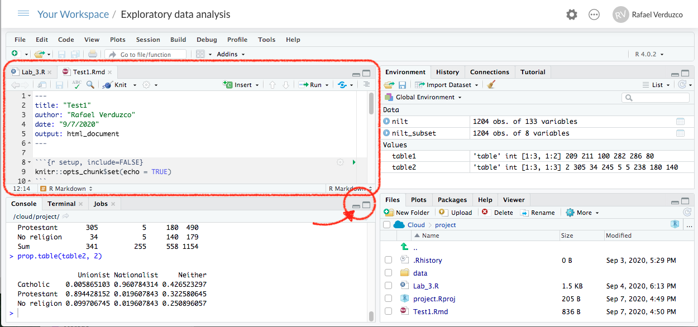
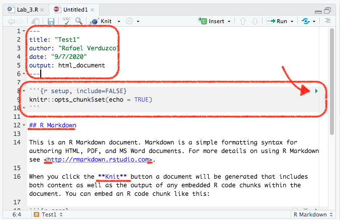
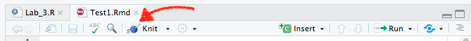

# Reporting in R Markdown

## Introduction

In the previous labs you were exploring the 2012 [Northern Ireland Life and Times Survey (NILT)](https://www.ark.ac.uk/nilt/). You've learnt how to download, read and format the data. Also, you've learnt how to explore categorical and numeric data and a mix of them. In this lab, you will learn about how to efficiently report quantitative results directly from R, using R Markdown, which is used by many academics and professionals in a workplace setting to communicate quantitative findings to a wider audience. R Markdown is also what you will use to write your research report assignment for this course. So, Let's dive in and learn more!  

## R Markdown

R Markdown (Rmd) is a **different** type of file included in R Studio (and it is actually a different programming language). This allows you to generate reports in common file types, such as `.html` (the same one used for this lab workbook you're reading right now), `.pdf` or word (`.doc`). The interesting thing is that the Rmd file allows you to integrate text, code, and plots directly into your report (so you do not have to copy and paste tables or graphs into a Word document, for example, which is often very messy and time-consuming). You have already seen how well this works in the lab workbooks so far, which are written entirely in R Markdown. 

The basic components of an Rmd file are: the **_code_**, **_text_** and **_metadata_**. The code is integrated by blocks called 'chunks', and the metadata contains information to format the report. We believe the best way to learn is by doing it. So, let's create your first Rmd document!

### First R Markdown document

We will continue working in the same project called _NILT_ in [RStudio Cloud](https://rstudio.cloud/).

1. Please go to your 'Quants lab group' in [RStudio Cloud](https://rstudio.cloud/) (log in if necessary);
2. Open your own copy of the 'NILT' project from the 'Quants lab group';
3. Create a new Rmd file, this is similar as creating and `R Script`, from the 'File' tab on the top-left: `File>New File>R Markdown...`;
4. Type 'Test1' in 'Tile' section and your name in the 'Author' box. Leave the 'Default Output Format' as `HTML`. Then, click 'OK'.
5. Save the Rmd file clicking on `File>Save as...`, type `Test1` in the 'File name' box, and click on the Save button.

After completing the previous steps, your screen should look like this:
```{r rmd-file, fig.cap="Rmd file.", echo=FALSE}

```

Note that now you have two files open in Pane 1, one tab includes the `R` script that we created in the last lab (called `Lab_3.R`), and the other is the `Rmd` document that you just created.

The Rmd document `Test1` contains an example by default. The first bit on the top enclosed by the dashes `---`, contains the general metadata to format the output, as shown in the Figure \@ref(fig:yalm-chunk). This bit is called YALM. In the default example, it contains the title, name of the author, data and the type of output (html). You can adjust this information directly by typing the relevant info (e.g. date or name).

```{r yalm-chunk, fig.cap="YALM and code chunk.", echo=FALSE}

```

Below the YALM shown in Figure \@ref(fig:yalm-chunk), there is another box. This is an `R` code 'chunk'. To run a chunk of code individually (that is to visualize a partial result of an `Rmd` document), you can click on the green arrow pointed on the top-left of the first chunk. 

In line 12, you have a second-level header, which contains the name of a section in the document. As you can see this is preceded by double hash tag `##`. If you want a first-level header section, you would require only one hash tag like this `#`, and three for a third-level header. Finally the 'Knit' word is enclosed by double asterisk `**`. This is to format the characters enclosed in bold.

In line 26, you will see a chunk including a basic plot. Let's check the results that this example in 'Test1' produce. 

To render the document from Rmd to HTML, we need to *Knit* it by clicking on the icon shown below. Try it!



RStudio may ask you if you want to update some packages, click 'Yes'.

After you knit the document, a window with the output will pop-up automatically. As you can see, this document contains the main title, followed by your name and date, as specified in the YALM. After, there is a second-level header which includes the first section of this example document. Also the the word 'Knit' is shown in bold, as it was wrapped by double asterisk `**`. 

An interesting thing is that we can integrate the result of our code in the output as we did with the second chunk (which starts in line 18). Here, we can use a summary of the data set `cars` (which is an in-built data set in `R` that contains only two variables).

<!-- Next, there is a second header, called 'Including Plots'. Under this section you can see a plot, but this time the code is not shown since `echo` was set to `FALSE`. You can close the pop-window when you finish exploring the output. -->

Similarly, you can create a `.pdf` file. To do this, instead of clicking on on the _Knit_ icon directly, click on the black arrow next to it. Then click 'Knit to PDF'. Try it and see the result.

When you knitted the document, R Studio actually created a new `.html` or `.pdf` file named as same as your Rmd document. You can confirm this in the 'File' tab in Pane 4. You can to download this file from the cloud to your local drive by clicking on the box of the output file. Then, click `More>Export...` in the same pane (or clicking on the gear icon in pane 4).

<!-- You can find more text styles and their respective syntax [here](https://bookdown.org/yihui/rmarkdown/markdown-syntax.html). -->

<!-- For a comprehensive list of chunk code options click [here](https://bookdown.org/yihui/rmarkdown-cookbook/chunk-options.html). -->

**IMPORTANT**: Rmd files are different from simple R scripts. While everything you write in an R script is interpreted as code, only the bits within the code chunks will be interpreted as code in Rmd files. Everything else not within chunks in an Rmd file is interpreted as text.


## Activity

In the `Test1.Rmd` file that you just created, do the following:

* Change the title of the document in the YALM to 'My first R Markdown document'.
* In the code chunk in line 21, replace the existing line (`summary(car)`) with the following: `glimpse(iris)`.
* In the code chunk called 'pressure', change `echo=FALSE` to `echo=TRUE`.
* At the very bottom of the script, create a new paragraph and write one or two lines briefly describing how you think quantitative methods are improving your discipline (e.g. politics, sociology, social and public policy, or central and eastern European studies).
* Knit the document in `html` format.
* Download the newly edited version of the `Test1.html` document to your machine.
* Discuss how each of the edits suggested above modify the output with your neighbour or your tutor.

<br>

Make sure you've got the basics of R Markdown, since this is the tool which you will write your final assignment (i.e. research report). If there is something not very clear, feel free to ask your tutor. They will be happy to answer your questions.

