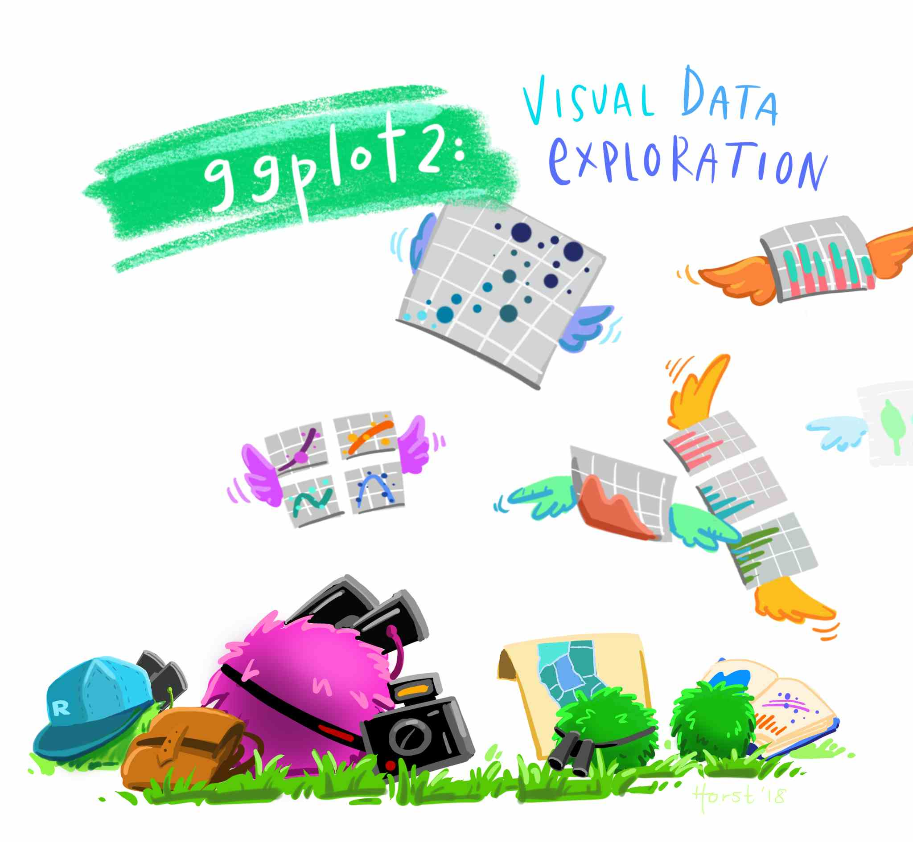
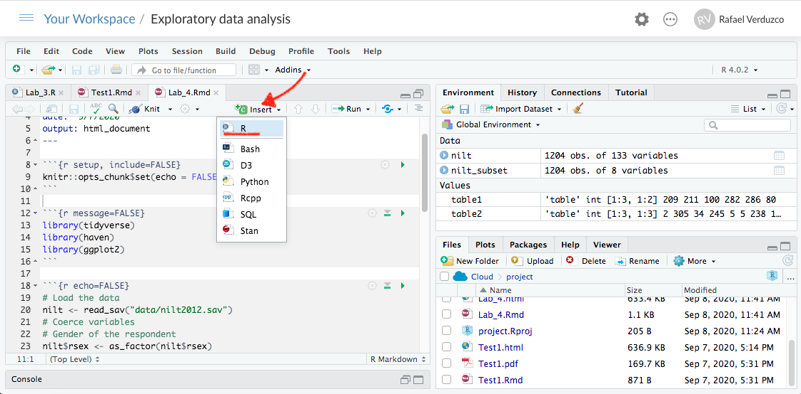

# Visual exploratory analysis

## Introduction

In this lab, we will extend your skills to explore data by visualizing it...and `R` is great for this! It is actually a demanded skill in the labour market.

Visualizing data is an important process in at least two stages in quantitative research: First, for your as a researcher to get familiar with the data; and second, to communicate your findings. `R` includes two important tools to achieve this: First, the `ggplot2` package (included in `tidyverse`) is a powerful tool to explore and plot data. Second, [R Markdown](https://rmarkdown.rstudio.com/) which allows you to create integrated quantitative reports.


## Data visualization

Visual data exploration with `ggplot2` (Artwork by \@alison_horst).
```{r fig.cap="Visual data exploration. Source: @Horst", echo=FALSE}

```

<!-- Visualizations are important for any quantitative analysis. These are helpful to identify overall trends, problems, or extreme values in your data at an initial stage. Additionally, visualizations are key to communicate your results at the final stage of the research process. These two stages are known as _exploratory_ and _explanatory_ visualizations, respectively. R includes some functionalities to create basic plots. These are often used to generate quick exploratory visualizations. In addition, `ggplot2`, which is one of the most popular data visualization tools for R, allows you to extend the base R capabilities and create publishable-quality plots. In this lab we will focus on `ggplot2`. -->

Different plot types serve different types of data. In the last lab we introduced some functions to summarise your data and to generate some summaries for specific types of variable. This will help you to decide what is the most suitable plot for your data or variable. The table below presents a minimal guide to choose the type of plot as a function of the type of data you intend to visualize. In addition, it splits the type of plot by the number of variables included in the visualization, one for _univariate_, or two for _bivariate_.  Bivariate plots are useful to explore the relationship between variables.

|  	|**Univariate**  	|  **Bivariate**	|  
|-	|--------------	|----------	|
| **Categorical** | Bar plot / Pie chart	| Bar plot  	|  
| **Numeric** 	|  Histogram / boxplot	| Scatter plot  	|
| **Categorical** + **Numeric** 	|  -	| Box plot 	|

<!-- Note that it is possible to include more than two variables in one plot. Perhaps more than 3 would add complexity and can make the plot difficult to interpret. In the next section we will talk in more detail about these plots using the 2012 NILT survey. -->

### Prepare the Rmd document and data

As we did in the last session, we will learn by doing. We will continue working in the same project called _NILT_ in [RStudio Cloud](https://rstudio.cloud/). Set up your session as following:

1. Please go to your 'Quants lab group' in [RStudio Cloud](https://rstudio.cloud/) (log in if necessary);
2. Open your own copy of the 'NILT' project from the 'Quants lab group';


Next, create a new Rmd document following the next steps.

1. Create a new Rmd file titled 'Lab 6. Data visualization', and write your name in the 'Author' space.
2. Save the Rmd file clicking on `File>Save as...`, using `Lab_6` in the 'File name' box, and click on the 'Save' button.
3. Delete all the contents in the default example with the exception of the first bit which contains the YALM and the first chunk, which contains the default chunk options. 
4. In the setup chunk (line 8), change `echo` from `TRUE` to `FALSE` (this will hide the code for all chunks in the output).

Once your Rmd document is ready, insert an R chunk to read and put the 2012 NILT data. To do this, click on the 'Insert' button on pane 1, and then click on 'R'. This will insert an R code chunk as the ones we explored in 'Test1'.

```{r fig.cap="Insert a code chunk.", echo=FALSE}

```

In the body of the first chunk, load the packages that you will need. For now, it will be only `tidyverse`.
```{r message=FALSE}
library(tidyverse)
```

Insert a second chunk. In the body of the code copy and paste the lines below. This is to load the data we downloaded and formatted in the last lab in R format using the `readRDS()` function (note that we are reading the `.rds` file and not the original `.sav` file). Also, we will create a subset called `nilt_subset` selecting only the variables that we are interested in for now, as we did in the previous lab.

```{r}
# Load the data from the .rds file we created in the last lab
nilt <- readRDS("data/nilt_r_object.rds")
#Create subset
nilt_subset <- select(nilt, rsex, rage, highqual, religcat, uninatid,  ruhappy, rhourswk, persinc2)
```

Run both chunks individually by clicking on the green arrow located on the top-right of the chunk, as described earlier.

<!-- Please notice that that we are able to load the NILT survey and we do not have to coerce it again into the correct type because we downloaded and saved the formatted data set in an `.rds` file before. Therefore, the data is stored in your R Studio Cloud project. Also, we did not need to install `tidyverse`, since we also did this in the past lab and we are working in the same project. Remember that if you create a new RStudio Cloud project, you will have to install the packages again. -->

Now that we read the data in, we are ready to start creating our own own plots using the 2012 NILT survey. You do not need to reproduce each of the examples in the following sections, but carefully read the description and try to understand the code syntax.

## Cateogrical variables

I will start using the same variables we summarised in our last lab. We started by computing the total number of respondents by gender in a One-Way contingency table. We can easily visualize this using a bar plot with `ggplot`. This package always takes at least three layers, namely _**data**_, _**aesthetics**_ and _**geometry**_. Here, we define the _data_ as the first argument of the `ggplot()`function with the `nilt_subset`. The second argument, _aesthetics_, is separated by a comma and it introduced using the function `aes()`. In this case we define the X axis `x = ` of the plot by the categories included in the variable `rsex`. The geometry is specified with the function `geom_bar()` without arguments for now. Note that we added the geometry using the plus sign `+` at the end of the previous line code. As an extra, I included the main title and the name of the x axis using the `labs()` function (you don't need to copy or run the following code chunks in your .Rmd. This is only for demonstration purposes).
```{r}
ggplot(nilt_subset, aes(x = rsex)) +
  geom_bar() +
  labs(title = 'Gender', x = 'Gender of respondent')
```

From the plot above, we can graphically see what we found out previously: there are more female respondents than males in our sample. The advantage is that we can have a sense of the magnitude of the difference by visualising it.

### Bivariate categorical vs categorical

In Lab 3, we computed a Two-Way contingency table, which included the count of two categorical variables. This summary can be visualized using a stacked bar plot. This is quite similar to the above, with the addition that the area of the vertical plot is coloured by the size of each group. 

If we wanted to know how gender is split by religion, we can add the `fill` argument with a second variable in aesthetics, as shown below.

```{r}
ggplot(nilt_subset, aes(x = rsex, fill = religcat)) +
  geom_bar() +
  labs(title = 'Gender by religion', x = 'Gender of respondent')
```

This plot is not very informative, since the total size of female and male respondents is different. The type of visualization will also depend on a specific research question or the topic you are interested in. I think it is worthwhile visualizing the religion by gender. By doing so, the plot will show us the magnitudes and composition by gender for each religion. To do this, we need to change the aesthetics, specifying the religion by category variable `religcat` on the `x` axis and `fill` with gender `rsex`.

```{r}
ggplot(nilt_subset, aes(x = religcat, fill = rsex)) +
  geom_bar() +
  labs(title = 'Religion by gender', x = 'Religion')
```

As we can see, catholic and protestant religion is equally popular among the respondents. Also, we can see that these are composed by similar proportions of males and females. One interesting thing is that there are more male respondents with no religion than female participants. Again, we found this out with the descriptive statistics computed in the last lab. However, we have the advantage that we can graphically see the magnitude of these differences.  

## Numeric variables

### Univariate numeric

Last time we talked about some measures of centrality and spread for numeric variables. The histogram plot is similar to the bar plot, the difference is that it splits the numeric range in fix bins and computes the frequency/count for each bin instead of counting the number of respondents for each numeric value. The syntax is practically the same as the simple bar plot. At this time, we set the the `x` aesthetic with the numeric variable age `rage`. Also, the geometry is defined as a histogram, using the `geom_histogram()` function.

```{r}
ggplot(nilt_subset, aes(x = rage)) +
  geom_histogram() +
  labs(title = 'Age distribution')
```

From the histogram, we have age (in bins) on the X axis, and the frequency/count on the y axis. This plot is useful to visualize how respondent's age is distributed in our sample. For instance, we can quickly see the minimum and maximum value, or the most popular age, or a general trend indicating the largest age group. 

A second option to visualize numeric variables is the box plot. Essentially this draws the quartiles of a numeric vector. For this time, `rage` is defined in the `y` axis. This is just a personal preference. The geometry is set by the `geom_boxplot()` function.

```{r}
ggplot(nilt_subset, aes(y = rage)) +
  geom_boxplot() +
  labs(title = 'Age boxplot')
```

What we see from this plot is the first, second and third quartile. The second quartile (or median) is represented by the black line in the middle of the box. As you can see this is close to 50 years old, as we computed using the `quantile()` function. The lower edge of the box represents the 2nd quartile, which is somewhere around 35 years old. Similarly the 3rd quartile is represented by the upper edge of the box. We can confirm this by computing the quantiles for this variable.
```{r}
quantile(nilt_subset$rage, na.rm = T)
```

### Bivariate numeric

A useful plot to explore the relationship between two numeric variables is the scatter plot. This plot locates a dot for each observation according to to their respective numeric values. In the example below, we use age `rage` on the X axis (horizontal), and personal income `persinc2` on the Y axis (vertical). This type of plot is useful to explore a relationship between variables. 

<!-- Let's imagine we are interested in personal income, we may therefore try to find the personal aspects related to personal income as an outcome. One reasonable characteristic can be age. We can hypothesize that personal income increases with time as they age (because an individual can have more experience or simply because of possible growing work-related benefits). Therefore we can suspect there is a relationship between these two variables.  -->

To generate a scatter plot, we need to define `x` and `y` in aesthetics `aes()`. The geometry is a point, expressed by `geom_point()`. Note that we are specifying some further optional arguments. First, in `aes()` `alpha` regulates the opacity of the dots. This goes from 0.0 (completely translucent) to 1.0 (completely solid fill). Second, in `geom_point()` we defined `position` as `jitter`. This arguments slightly moves the point away from their exact location. These two arguments are desired in this plot because the personal income bands are overlapped. Adding some transparency and _noise_ to their position, can allow to visualize possible patterns easily.

```{r}
ggplot(nilt_subset, aes(x = rage, y = persinc2, alpha = 0.8)) +
  geom_point(position = "jitter") +
  labs(title = 'Personal income vs age', x = 'Age', y = 'Personal income (£)')
```

There is not a clear pattern in our previous plot. However, it is interesting to note that most of the people younger than 25 years old earn less than £20K a year. Similarly, most of the people older than 75 earn less than £20K. And only very few earn over £60k a year (looking at the top of the plot).

## Mixed data

Very often we want to summarise central or spread measure by categories or groups. For example, let's go back to the example of age and gender. We can visualize these two variables (which include one numeric and one categorical) using a box plot. To create this, we need to specify the `x` and `y` value in `aes()` and include the `geom_boxplot()` geometry.

```{r}
ggplot(nilt_subset, aes(y = rage, x= rsex)) +
  geom_boxplot() +
  ggtitle('Age by gender')
```

From this, we can visualize that female participants are slightly younger than their male counterparts in the sample. 

<!-- ### Additional resources -->

<!-- We have seen and practised some data visualizations with a real-word data set. I tried to keep the things as simple as possible. There are a number of features that you can customize in your plots, including the background, text size, colours, adding more variables, etc. Perhaps a place to start expanding your skills is the [Data Visualization with ggplot2 Cheat Sheet](https://rstudio.com/wp-content/uploads/2015/03/ggplot2-cheatsheet.pdf). An extra tip is that you can change the overall look of the plot by adding pre-defined themes. You can read more about it [here](https://ggplot2.tidyverse.org/reference/ggtheme.html). Another interesting site is the [The R Graph Gallery](https://www.r-graph-gallery.com/), which includes a comprehensive showcase of plot types and their respective code. -->

## Activity

Using the `nilt_subset` object, complete the tasks below in the Rmd file `Lab_6`, which you created earlier. Insert a new code chunk for each of these activities and include brief comments as text (outside the chunk) in the Rmd document to introduce or describe the plots. Feel free to copy and adapt the code to create the plots in the examples above.

* Create a first-level header to start a section called "Categorical analysis";
* Create simple bar plot using the `geom_bar()` geometry to visualize the political affiliation reported by the respondents using the variable `uninatid`;
* Based on the plot above, create a 'stacked bar plot' to visualize the political affiliation by religion, using the `uninatid` and `religcat` variables;
* Create a new first-level header to start a section called "Numeric analysis";
* Create a scatter plot about the relationship between personal income `persinc2` on the Y axis and number of hours worked a week `rhourswk` on the X axis;
* Finally, create a box plot to visualize personal income `persinc2` on the Y axis and self-reported level of happiness `ruhappy` on the x axis... Interesting result, Isn't it? Talk to your lab group-mates and tutors about your results on Zoom (live) or your Lab Group on Teams (online anytime);
* Briefly comment each of the plots as text in your Rmd file;
* Knit the .Rmd document as HTML or PDF. The knitted file will be saved automatically in your project. You can come back to the Rmd file to make changes if needed and knit it again as many times as you wish.
