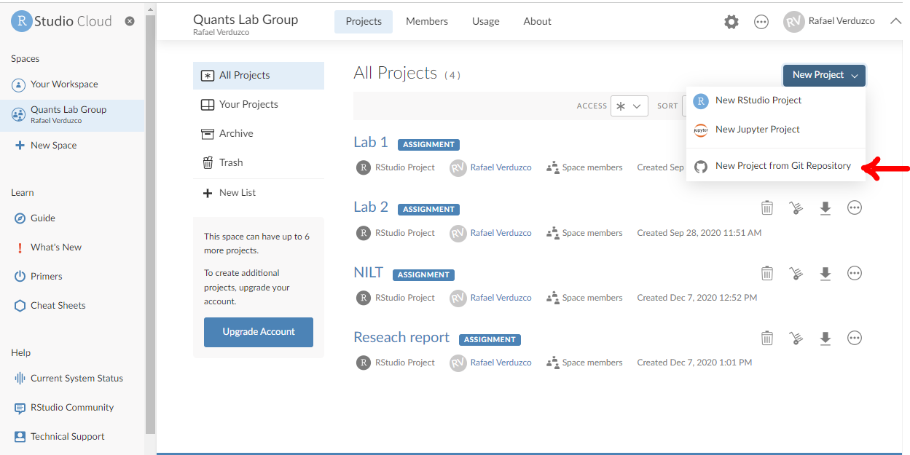
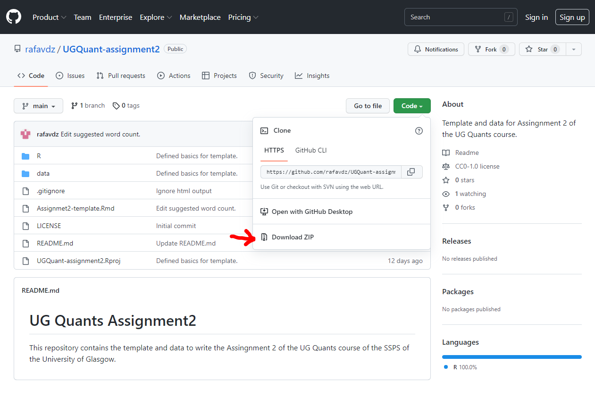
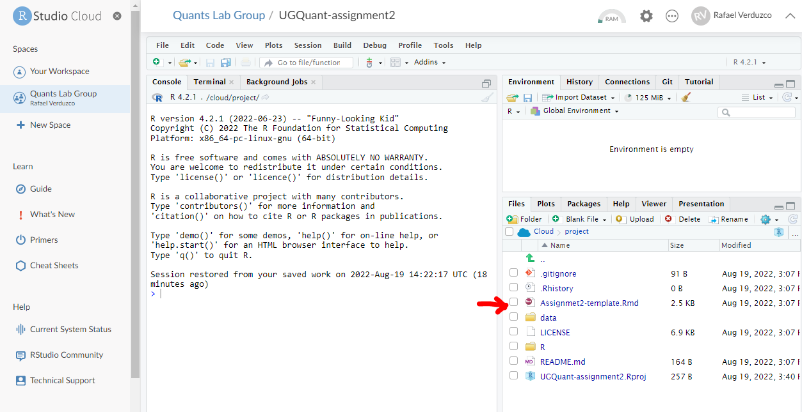

# UG Quants summative assessment: Interpreting Quantitative Findings Report

## Introduction

This is our final practical session. Thank you for tuning in and all your hard work! Today, we will discuss some practical aspects of the summative assessment *Interpreting Quantitative Findings Report*. You will actually start working on the assignment today by creating a template you can use to write your report in RStudio. Also, you will get familiar with the structure and the contents of the template. Remember, this is the perfect time to clarify as many questions as possible. Your tutor will be more than happy to help!

Before proceeding, please take about 10 minutes to read the instructions for the assignment available in Moodle.


## Create your research report template from GitHub

We've created a GitHub repository which contains an RStudio project and all the essentials you need to start writing your report. There are two options for you. One is writing in **RStudio Cloud**, as we have been doing all along this course. Alternatively, you can also use the **RStudio Desktop** version (this requires having `R` and RStudio installed locally on your device). The result will be the same and the process is very similar. So, the choice is totally up to you and what your preference is. Here, we explain how to start your own project for both options. 

For this session, try only _one_ of these. Don't worry about which one you choose now, you can change your mind later. If you can't make up your mind, then try the **RStudio Cloud** route first, as it means you can work on your assignemnt on any devices, regardless of the computational power of your device, but it does mean you need to work on the assignment online using a web browser. If online connection is an issue for you, then choose the **RStudio Desktop** route. 

### RStudio Cloud version

If you wish to write your project using RStudio Cloud, please follow the next steps:

1. Access [RStudio Cloud](https://rstudio.cloud/) as usual.
2. Make sure you are in your Quants lab group (not in 'Your Workspace').
3. Click on the 'New Project' button and select 'New Project from Git Repository'.
```{r fig.cap="New project from GitHub.", echo=FALSE}

```
4. Paste the following URL in the box and click 'OK': https://github.com/rafavdz/UGQuant-assignment2.
5. You are all set! Just click on the project to access the contents.

### RStudio Desktop version

If alternately you decide to write your assessment using the RStudio Desktop version, consider the following steps:

1. Access the following GitHub repository copying and pasting the following URL in your browser: <https://github.com/rafavdz/UGQuant-assignment2>.
2. Click on the 'Code' button and select the 'Download ZIP' option, as shown below.
```{r fig.cap="Downlowad ZIP from GitHub.", echo=FALSE}

```
3. Go to your local downloads folder, right click on the `UGQuant-assignment2-main.zip` and choose the 'Extract all' option (here, you can also chose the folder where you want to store the RStudio project and write your assignment). 
4. Click on the 'Extract' button.
5. As you can see, this folder contains an RStudio project. Open the `UGQuant-assignment2.Rproj` which will initialize a new RStudio session.


## About the research report template

Once in your **UGQuant-assignment2** project, open the `Assignmet2-template.Rmd` file in Pane 4 under the 'Files' tab, as shown below.

```{r fig.cap="Template.", echo=FALSE}

```

This template contains the following:

* Suggested structure of the report.
* Suggested word count for each section.
* The code necessary to run and present the results of a multivariate linear regression.

In essence, this is the basic structure to start writing your assignment. Of course, you can add, edit, and customize as much as you consider appropriate. Remember, this is just a generic suggestion and you should still address all the points to the best of your abilities. **Remember: There are no hard and fast rules to say what's right or wrong.** You are the one who can determine and justify why you did what you did. There are also many ways to write and approach this assignment, so make choices based on your own interest(s) and disciplinary background. It is truly your time to shine! The course handbook also gives important pointers on how your report will be assessed, offering some guiding questions to tackle the report--don't skip this crucial step. 


## Activity 1

1. In the template, fill in the 'author' and 'date' space in the YALM at the top of the file with your student number and appropriate information using quotation marks.
2. Knit the `Rmd` file as `html` (RStudio will ask to install some packages, click 'Yes').
3. In the output, look at the results of the table under the 'Results' section and identify the *dependent* and the *independent* variables. You can learn about the meaning of these variables in the NILT documentation ([click here to access the documentation](https://www.ark.ac.uk/teaching/NILT2012TeachingResources.pdf)).
4. Identify the variables that are significant in this model and the direction of the relationship.
5. Discuss your interpretations with your neighbour or tutor. You can refer back to [Lab 8](#simple-lm) and [Lab 9](#multi-lm) to refresh your memory.

## Activity 2

1. Write one introductory paragraph in the 'Introduction' section of the template according to the guidance provided and your preliminary insights.
2. Knit the document again.


## Conclusion 

You are on the right track now!

We hope that by getting familiar with this setting, you will easily succeed in writing your research report using all the knowledge and skills acquired during this course. Take this session to ask questions about the assignment or the course in general as much as possible. This is the right time to have specialized one-to-one support from your tutors.

We wish you the best of luck! Get in touch with your tutors via email or, even better, post any questions you have about the assignment on your lab group discussion forum on Moodle, if you don't know where to start or get stuck. Don't suffer in silence. Remember your Tutors, lab group mates, and the teaching and admin team are here for you. Also don't forget coding is _all_ about **trial and error**, so it's completely normal to write / copy and paste some code, then get an error message, and basically for your code to not work. Keep chipping at it, which sometimes can take hours (if not days), until you can get it to work. That's a normal process even for professional data scienctists and quantitative researchers! So do persevere and don't panic if you don't get it to work right away, because troubleshooting your code is part of the work, in addition to making your own choices in the analysis and reporting. For the code, the error message you get often gives you clues about, well, where the error is. So read the error message carefully, it might be you haven't loaded the package required to run the code (remember to do this every time you open RStudio) or you might have missed a paratheses, or you might have not capitalised a word in the R syntax when you need to. Double check the R cheatsheets or previous sections in the lab workbook to ensure you have specified R syntax/arguments correctly. Again, trial and error is your friend, unlike writing an essay/doing an exam. 

Good luck and have fun! You got this. 
