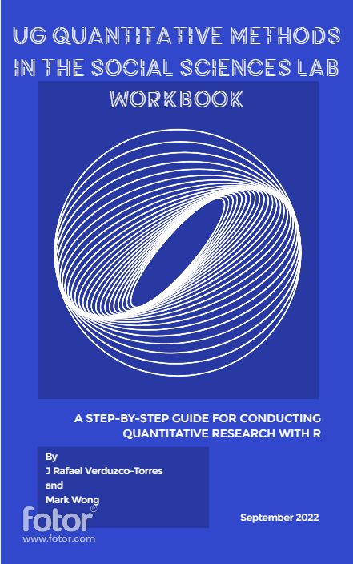

--- 
title: "UG Quantitative Methods in the Social Sciences lab workbook"
subtitle: "A step-by-step guide for conducting quantitative research with R"
author: "by J Rafael Verudzco Torres and Mark Wong"
date: "`r Sys.Date()`"
site: bookdown::bookdown_site
output: bookdown::gitbook
documentclass: book
bibliography: [book.bib, packages.bib]
biblio-style: apalike
link-citations: yes
github-repo: rstudio/bookdown-demo
description: "This is the workbook you will use for the Quantitative Methods in the Social Sciences lab sessions."
---

```{r setup, include=FALSE}
knitr::opts_chunk$set(fig.align="left", eval = TRUE, message=FALSE, warning=FALSE, out.width = "100%" )
library(tidyverse)
```

# Welcome{-#Welcome}




Welcome to the Quantitative Methods in the Social Sciences lab!

This woorkbook is targeted to University of Glasgow students enrolled in the Undergraduate Quantitative Research Methods course of the School of Social & Political Sciences. The activities are designed for [RStudio Cloud](https://rstudio.cloud/).

The book was written using `R` [bookdown](https://github.com/rstudio/bookdown) package based on the GitHub repository: <https://github.com/rstudio/bookdown-demo>.


<br>


The online version of this book is licensed under the [Creative Commons Attribution-NonCommercial-ShareAlike 4.0 International License](http://creativecommons.org/licenses/by-nc-sa/4.0/).
